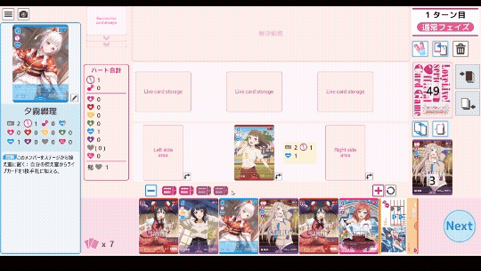
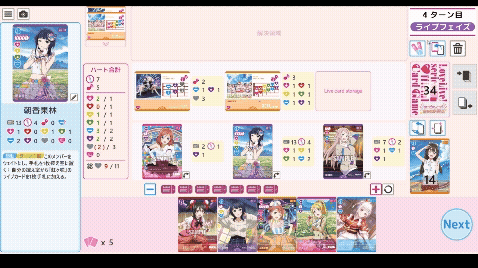
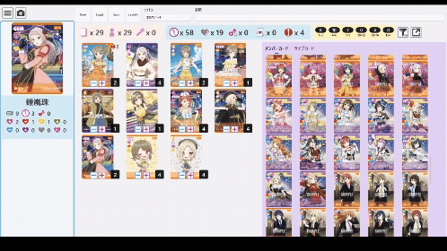

# LoveCas
ラブカシミュレーター(ラブカス)

## 概要
ラブカの一人回しをWindows上で行うツール。
デッキ作成やワンクリックでのウィンドウキャプチャも可能。

## 導入方法
インストールは不要です。
1. Releasesにあるzipファイルをダウンロードする
2. ダウンロードしたzipファイルを任意の場所で解凍する
3. 「LoveCas.exe」を実行する

※警告(SmartScreen)が表示された場合は「詳細情報」→「実行」をクリックして実行してください。  
※実行ファイル、dllには自己署名を付与しています。

使い方は[Usage.md](docs/Usage.md)を参照してください。

## 環境要件
- Windows11 (10.0.22621.0以降を推奨)
- .Net 9

※場合によってはC++再頒布可能ランタイムが求められる可能性があります。

## 利用条件
- 個人でのローカルの利用は自由です。
- 本ツールのキャプチャ・動画のWeb上への掲載は可能です。
    - これに伴う間接的な商用利用は可。商用の際はなるべく配布URL等の掲載をお願いします。(note等)
- 再配布は禁止です。
- 本ツールをリバースエンジニアリングすることは禁止です。
- 本ツールの改変は禁止です(ただし、データとして使用しているjsonを除く)。
- 本ツールに含まれる画像やアセットを取り出しての流用は禁止です。

## 機能
- プレイ画面 :
    - ドラッグでカードを移動
    - ハートやスコア等の合計数を自動で計算
    - ドローやエールを簡易化
    - デッキ編集画面で作成したデッキの読み取り
    - 場のカードのステータスを変更
    - カードのステータスとテキストを表示
- デッキ編集画面
    - アプリ内で使用するデッキの作成・編集
    - デッキをファイルとして保存・読み取り
    - 枚数やポイントシステムなどの自動算出
    - カード一覧のフィルター
    - カードのステータスとテキストを表示
- デッキ表示ウィンドウ
    - デッキのカードを一覧表示する(キャプチャ用)
    - 枚数やポイントシステムなどの自動算出
- 共通
    - 現在のウィンドウをキャプチャして保存

## 更新履歴

[History](History.md)を参照ください。

## その他のライセンス
- フォント: Rounded x M+
- CommunityToolkit.WinUI.Controls.Primitives
- ReactiveProperty
- Microsoft.WindowsAppSDK
- Microsoft.Extensions.DependencyInjection

※本ツール内のライセンス表記も参照ください。

## 免責事項
- 本ツールの利用による障害・損害については一切の責任を負いません。
- カードの画像は©株式会社ブシロードまたはその関連会社に帰属します。
- 権利者の要請により公開・配布を中止する場合があります。
