# LoveCas使い方
ラブカシミュレーター(ラブカス)の使い方についての説明。

## 基本的な使い方
基本的にはドラッグでカードを移動、クリックや右クリックで操作。

**`極度に速い操作は(スペックにより)ツールが落ちる可能性が高まるため避けてください。`**  

### プレイ画面(シミュレーション)
プレイ画面では画面右下のNextボタンでターンを進行する。
1. 開始や読み取りをクリックする。
    1. 使用するデッキのjsonファイルを読み取る。
2. ライブの準備  
   最初の手札やエネルギーが準備される
    1. マリガンを行う。不要な手札を控え室に置き、その枚数分デッキをクリックしてドローする。
    2. Nextボタンを押す。控え室のカードがデッキに加わり、1ターン目に移行する。
3. 通常フェイズ
    1. アクティブフェイズ、エネルギーフェイズ、ドローフェイズが自動で行われる。
    2. 通常フェイズを行う。エネルギーマークをクリックしてエネルギーを使用し、カードをプレイする。この時点でライブカードも出せる(必要なハートの数の参考になる)
    3. フェイズを終了したい場合、Nextボタンをクリックする。
4. ライブフェイズ
    1. ライブカード置き場にカードを置き、その枚数分ドローする。
    2. ライブをする場合はブレードの数分だけエールボタンを押してエールを行う。
    3. ライブ成功したら自身の判断で勝敗を決める。
    4. ターン終了したい場合、Nextボタンをクリックする。エール領域や解決領域、ライブカード置き場のカードが自動で控え室に送られ、次のターンに進む。

## GUI
### トップ・メニュー

**トップ画面**  
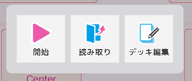
|名前|画像|説明|
|---|---|---|
|開始||最後に選択されたデッキでシミュレーションを開始する。|
|読み取り||デッキを読み取り、シミュレーションを開始する。|
|デッキ編集||デッキ編集画面へ移動する。|

**メニュー**  
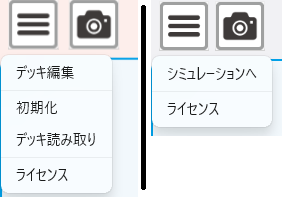
|名前|説明|
|---|---|
|デッキ編集|デッキ編集画面へ移動する。|
|シミュレーションへ|プレイ画面へ移動する。|
|初期化|シミュレーションを初期化し、トップを表示する。|
|デッキ読み取り|デッキを読み取り、シミュレーションを開始する。|
|ライセンス|アプリとライセンス情報を表示する。|

### プレイ画面
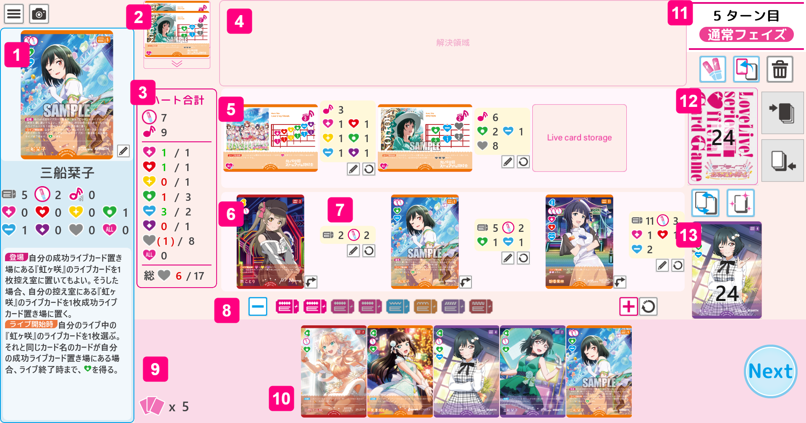

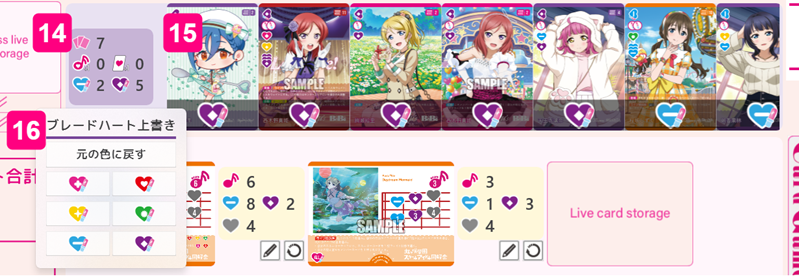

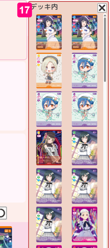

|#|名前|説明|
|---|---|---|
|1|詳細パネル|クリックしたカードの詳細情報が表示される。 拡大画像をクリックすると、カード番号や最初の収録パックが表示される。|
|2|成功ライブカード置き場|ライブカードをドラッグ&ドロップで移動できる。|
|3|集計パネル|スコアやブレード、ステージ上のハートの合計とライブカードの必要ハート、エールの合計が計算されて表示される。 ウェイト状態のメンバーのブレードは加算されない。|
|4|解決領域|カードをドラッグ&ドロップで移動できる。「上から見る」効果の場合、カードはここに置かれる。|
|5|ライブカード置き場|カードをドラッグ&ドロップで移動できる。 ライブカードでない場合はステータスパネルは表示されない。|
|6|メンバーエリア|メンバーカードのみをドラッグ&ドロップで移動できる。 移動先に既にカードがある場合は「バトンタッチ」となり、既にあったカードは控え室に送られる。|
|7|ステータスパネル|カードがある場合、そのカードの現在のステータスが表示される。|
|8|エネルギーカード置き場|エネルギーマークをクリックすると、明<=>暗が入れ替わる。支払ったコストは灰色にするとわかりやすい。 右クリックする毎に色を変えられる(桃→青→橙→紫→赤。エネルギーブースト向け)。|
|9|手札枚数|現在の手札の枚数|
|10|手札|手札のカード。枚数が多い場合はマウスホイールで左右にスクロール可能。|
|11|ターン・フェイズ表示|現在のターン数とフェイズが表示される。|
|12|メインデッキ置き場|クリックするとカードを1枚引くことができる。 数字は残り枚数。 右クリックでデッキの中身を表示、別エリアへ移動できる。|
|13|控え室|カードをドラッグ&ドロップで移動できる。一番最後に控え室に入ったカードが表示される。 クリックすると控え室のカード一覧が表示され、そこからカードをドラッグ&ドロップで移動できる。|
|14|ブレードハート合計パネル|エールで出されたカードのブレードハートの合計が表示される。|
|15|エール領域|カードをドラッグ&ドロップで移動できる。エールで出されたカードが並び、ブレードハートが表示される。 エールしているカードが存在するときのみ表示される。|
|16|ブレードハート上書きメニュー|ブレードハート合計パネルをクリックすると表示される。 エールでめくられているカードのブレードハートの色を変更する。|
|17|デッキの内容|メインデッキを右クリックすると表示される。 デッキ内のカードの一覧が表示される。一番上と一番下に置かれたカードは先頭と最後尾に表示される。|

**ボタンについて**

名前|画像|説明|
|---|---|---|
|メニューボタン||各種操作のメニューが開く。|
|キャプチャボタン||ウィンドウ内をキャプチャして画像として保存する。|
|向き変更ボタン||メンバーカードのアクティブ<=>ウェイト状態を変更する。|
|ステータス編集ボタン||選択・表示されているカードのステータスを編集するダイアログを開く。 デッキ・控え室のカードのステータスは編集できない。|
|Nextボタン||次のフェイズ、ターンへ移行する。ターン開始時や終了時の処理は自動で行われる。 (ドロー、エネルギーアクティブ、エネルギー追加、残ったライブカードとエールカードの移動)|
|エールボタン||1回クリックすると、メインデッキからエール領域にカードを1枚追加する。解決領域は隠される。|
|めくるボタン||1回クリックすると、メインデッキから解決領域にカードを1枚追加する。|
|クリーンボタン||解決領域とエール領域のカードをすべて控え室に移動する。|
|デッキトップエリア||カードをここへドラッグ&ドロップすると、そのカードはメインデッキの1番上に置かれる。|
|デッキボトムエリア|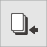|カードをここへドラッグ&ドロップすると、そのカードはメインデッキの1番下に置かれる。|
|シャッフルボタン||メインデッキをシャッフルする。|
|リフレッシュボタン||リフレッシュを行う。 控え室のカードはすべてメインデッキに加わり、シャッフルされる。|
|エネルギー(−)ボタン||エネルギーの数を1減少させる。|
|エネルギー(＋)ボタン||エネルギーの数を1増加させる。|
|エネルギーリセットボタン||エネルギーをすべてアクティブ状態に変更する。|
|元の色に戻すボタン|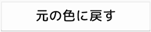|エール中のカード全てのブレードハートの色を元に戻す。|
|ブレードハート上書きボタン|他|エール中のカード全てのブレードハートの色を選択した色に変更する。|

#### 集計パネルの見方
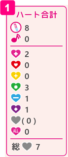
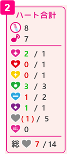
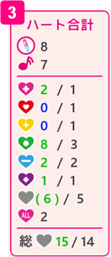

- ブレード:  
    ステージのメンバーのブレードの数の合計。  
    ウェイト状態のメンバーのブレードは加算されない。
- スコア:  
    ライブカードのスコアの合計値。 
    メンバーやブレードハートのスコア加算がある場合は隣に"+1"の様に表示される。
- ハート(色あり・ALL):  
    左がメンバーやブレードハートからなるライブ所有ハートの合計値。  
    右がライブカードの必要ハートの合計値。必要ハートがある場合のみ表示される。  
    ライブ所有ハートは、不足している場合は赤、足りている場合は緑、ALLハートによって足りている場合は青の文字色になる。
- ハート(無色):  
    左が色ありハートとALLハートの余剰分の合計値で、無色ハートに割り当てられる数がここに表示される。( )で表される。  
    ALLハートの数が色ありハートの不足分を満たす場合、その分は無色ハートの割り当てから外される。  
    右がライブカードの必要ハートの合計値。必要ハートがある場合のみ表示される。
- 総ハート:
    ライブ所有ハートと必要ハートそれぞれの総数。

すべてのライブ所有ハートの数字の色が赤でなければライブ成功。
緑や青ならば足りている状態。

### ステータス変更ダイアログ
メンバーカード  
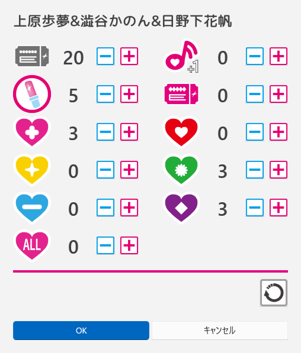

ライブカード  
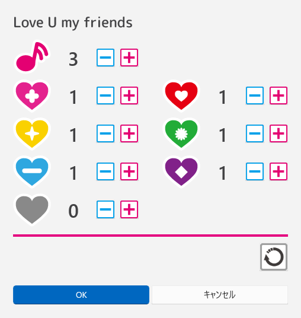

|名前|画像|説明|
|---|---|---|
|プラスボタン||そのパラメーターを+1する。|
|マイナスボタン||そのパラメーターを-1する。|
|リセットボタン||そのカードの元々のステータスに戻す。|
|OKボタン||ステータスの変更を確定させる。 変更したステータスは場を離れると元に戻る。|
|キャンセルボタン||ステータスの変更を取りやめる。|

### デッキ編集画面
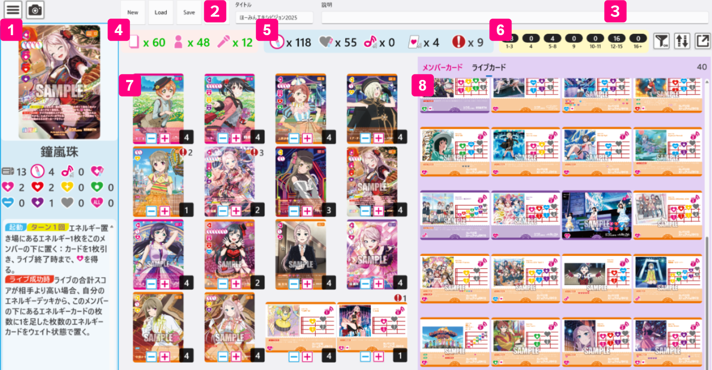

|#|名前|説明|
|---|---|---|
|1|詳細パネル|クリックしたカードの詳細情報が表示される。 拡大画像をクリックすると、カード番号や最初の収録パックが表示される。|
|2|タイトル|デッキにつける名前。保存されるデフォルトファイル名にもつけられる。|
|3|コメント|デッキにつける説明。|
|4|枚数表示|現在のデッキの総枚数とメンバーカード、ライブカードの枚数。|
|5|集計表示|現在のデッキのブレード数合計、ブレードハート(ハート、スコア、ドロー)を持つカードの枚数とラブカポイントシステムの現在の合計値。|
|6|コスト毎の枚数|各コスト帯毎の採用枚数。|
|7|デッキエリア|デッキのカード一覧。右下は枚数。0枚になるとデッキから取り除かれる。|
|8|ライブラリエリア|カード一覧。メンバーカードとライブカードはタブで切り替えて表示できる。 カードをデッキの方にドラッグすると追加できる。|

**ボタンについて**

|名前|画像|説明|
|---|---|---|
|New ボタン||新規作成ボタン。現在のデッキのカードをリセットする。|
|Load ボタン||読み込みボタン。保存したファイルを選択してデッキを呼び出す。|
|Save ボタン||保存ボタン。保存済みのファイルに上書きして保存する。 LoadまたはSaveAs済みの場合に使える。|
|SaveAs ボタン||名前をつけて保存ボタン。ファイルを指定してデッキをファイルに保存する。 保存するファイル名の初期値は (yyyyMMdd_デッキ名).json|
|フィルターボタン| |フィルターダイアログを表示する。|
|デッキ表示ボタン||現在のデッキの内容を新しいウィンドウで表示する。|

### カード一覧フィルターダイアログ

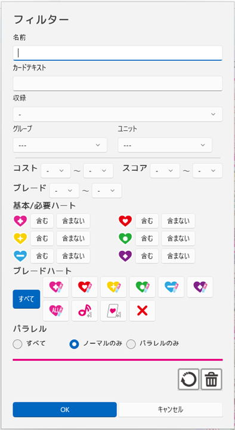

デフォルトで「ノーマルのみ」になっている。  

### デッキ表示ウィンドウ

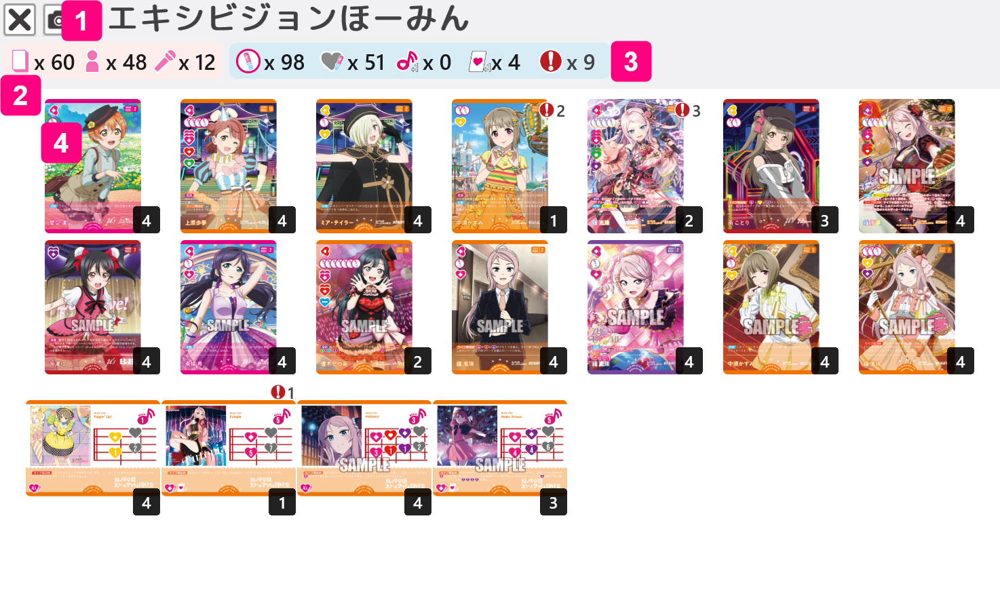

|#|名前|説明|
|---|---|---|
|1|日付|デッキを最初に作成(SaveAs)した日付。|
|2|タイトル|デッキにつけられた名前。|
|3|枚数表示|現在のデッキの総枚数とメンバーカード、ライブカードの枚数。|
|4|集計表示|現在のデッキのブレード数合計、ブレードハート(ハート、スコア、ドロー)を持つカードの枚数とラブカポイントシステムの現在の合計値。|
|5|デッキのカード|デッキのカード一覧。右下は枚数。 ウィンドウのサイズを変更すると、最大9列の表示になる。|

## ファイル

**%ドキュメント%¥LoveCas¥Deck¥**

デッキを保存する際のデフォルトフォルダ

|名前|説明|
|---|---|
|default.json|ツール起動時に初期選択されるデッキ。 虹ヶ咲のスタートデッキになっている。|
|(任意の名前).json|保存されたデッキ。|

**%ドキュメント%¥LoveCas¥Capture¥**

カメラボタンでのキャプチャ画像が保存されるフォルダ。  
ファイル名は日時: (yyyyMMdd_HHmmss).png

### デッキファイルの詳細

準備中
